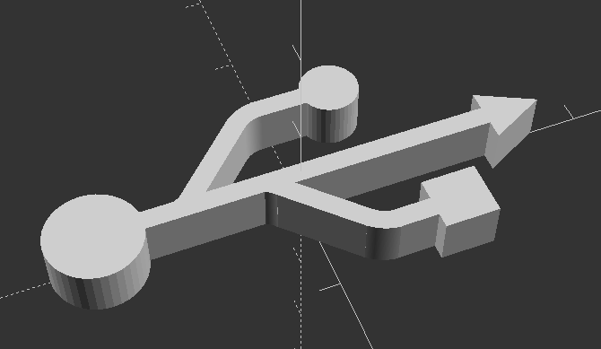
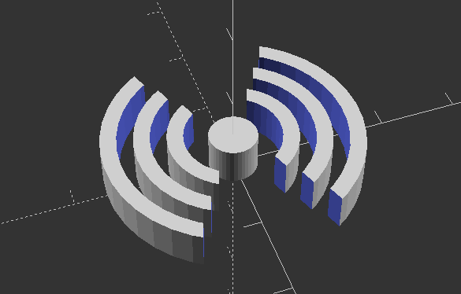
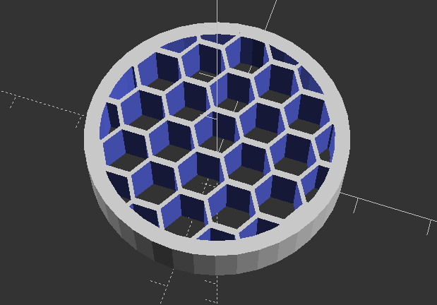
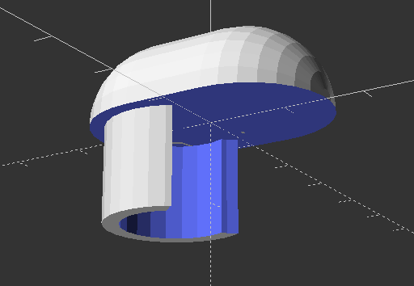
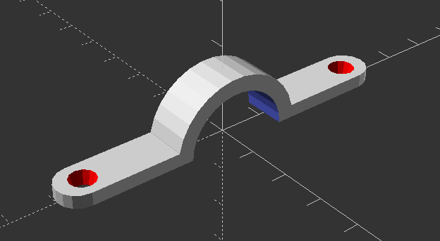
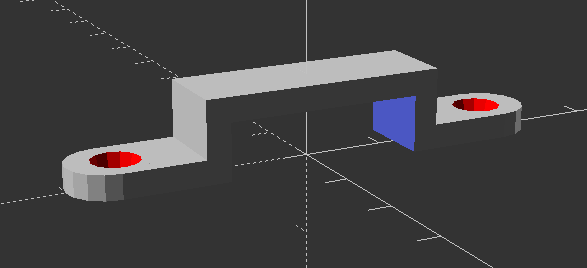
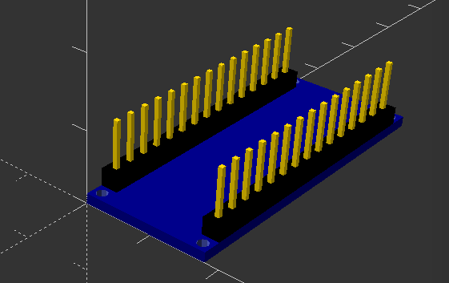
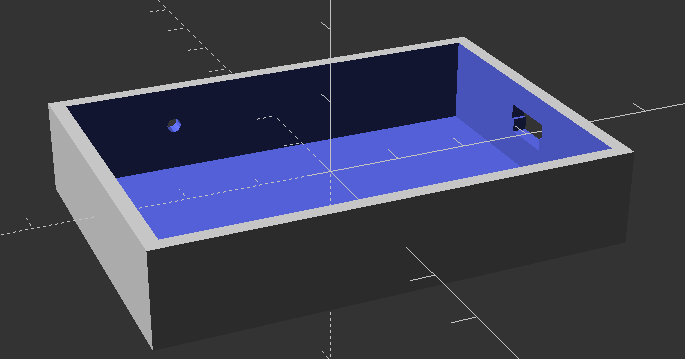

# 3D models done in OpenSCAD

Here's various 3d models I've designed in OpenSCAD mostly to be 3d printed.

### USBLogo.scad

### NFCLogo.scad

### Speaker_BarCade.scad

### Terrace_Chair_Top_Cap.scad

### Round_Strap.scad

### Square_Strap.scad

### ArduinoNano.scad

### ArduinoNano_RFID_Box.scad

