# 3D models done in OpenSCAD

Here's various 3d models I've designed in OpenSCAD mostly to be 3d printed.

Some models are probably silly and not optimal as I'm still learning OpenSCAD, you've been warned...

### USBLogo.scad
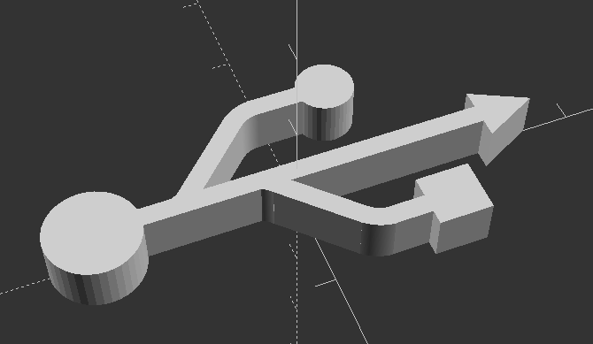

### NFCLogo.scad
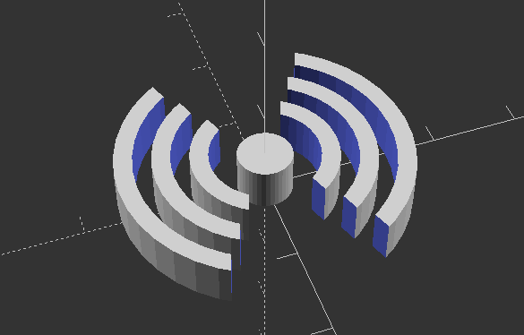

### Speaker_BarCade.scad
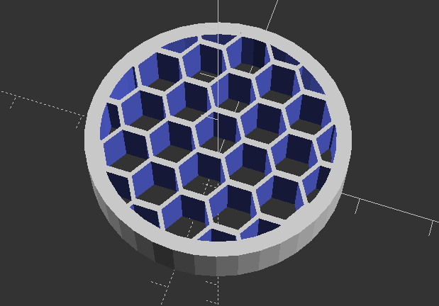

### Terrace_Chair_Top_Cap.scad
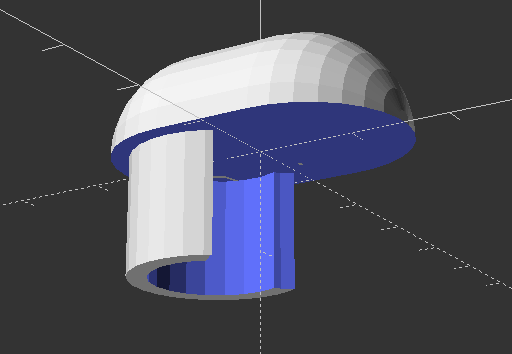

### Round_Strap.scad
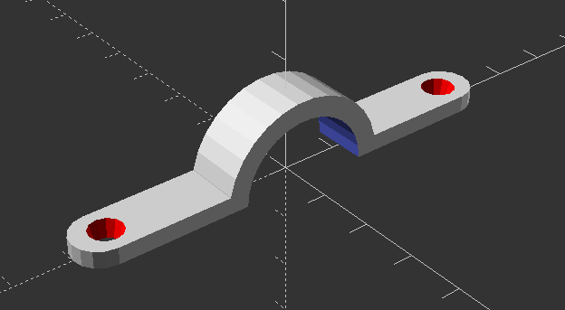

### Square_Strap.scad
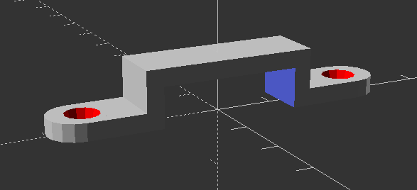

### ArduinoNano.scad
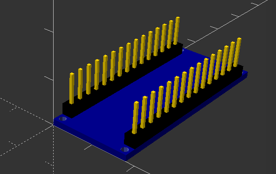

### ArduinoNano_RFID_Box.scad
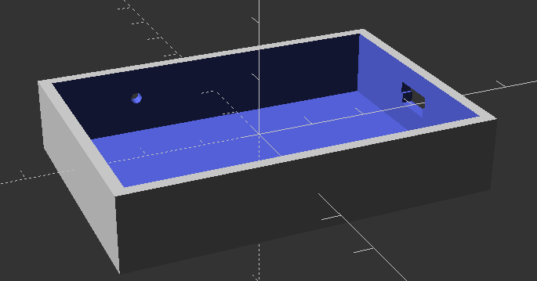

### ArduinoNano_RFID_Box_Top.scad
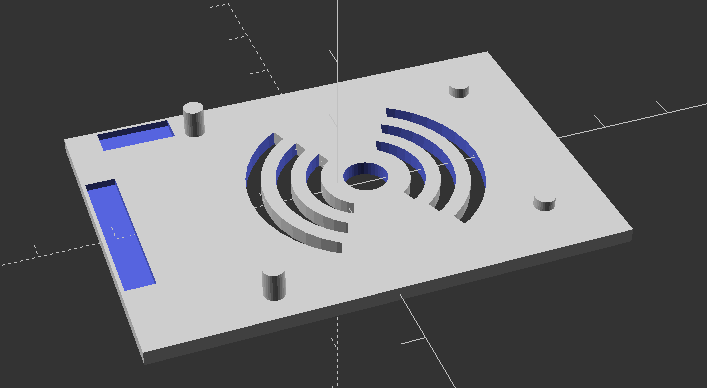

### Pill.scad
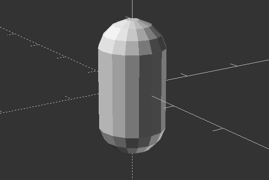

### Teensy++2.scad
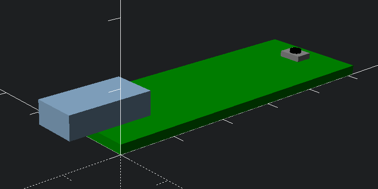

### Teensy++2_enclosure.scad
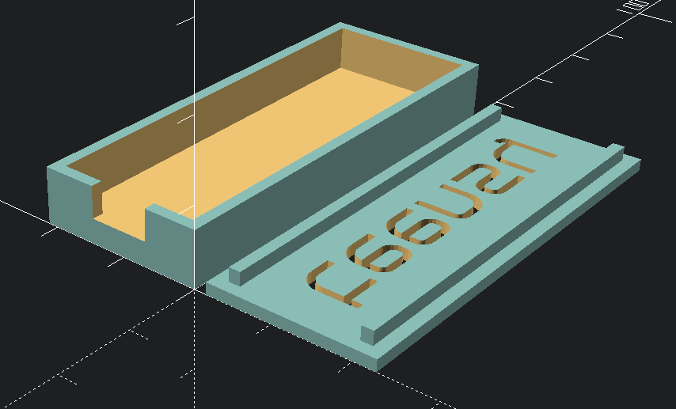

### Teensy++2_enclosure_rounded.scad
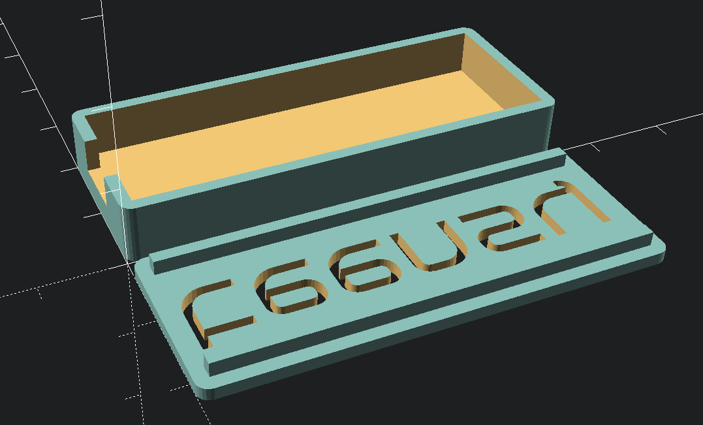

